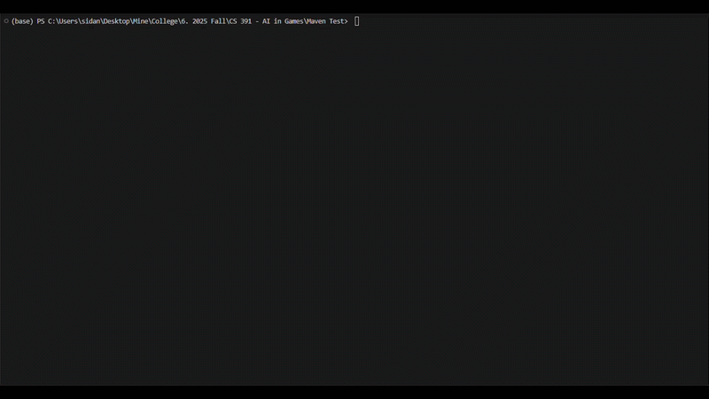

# Saint Petersburg AI Player

An AI agent for **Saint Petersburg** (the card game), built for CS 391 – AI in Games. The flagship player, [`AIDanSPMCTSPlayer`](saint-petersburg/src/main/java/AIDanSPMCTSPlayer.java), combines Monte Carlo Tree Search with a learned heuristic evaluation function so it can make strong decisions without playing out full games during search.



## Approach

- **Search**: `AIDanSPMCTSPlayer` runs UCT-based MCTS (ported from Marc Lanctot's OpenSpiel implementation) with early playout termination — instead of simulating all the way to a terminal state every rollout, it stops after a few random steps and scores the resulting state with a learned evaluation function.
- **Evaluation**: that scoring function is a logistic regression model ([`AIDanSPStateFeaturesLR3`](saint-petersburg/src/main/java/AIDanSPStateFeaturesLR3.java)) trained on hand-designed features (score differential, rubles differential, unique-aristocrat bonuses, cards in hand, etc.) plus pairwise interaction terms, trained via the [Smile](https://haifengl.github.io/) ML library on self-play game logs.
- **Time management**: `getAction(state, timeRemainingMillis)` estimates how many decisions remain in the game (via a few quick random playouts) and allocates a fraction of the clock to each move, so the player can respect per-game time budgets in tournament play.
- This repo also tracks the earlier iterations that led here — flat Monte Carlo trainers, an expectiminimax player, and several rounds of feature/model experimentation (`AIDanSPStateFeaturesLR32/LR4/LR5/RF1`) — each was a step in tuning the evaluation function before landing on the MCTS + LR3 combination above.

## Project structure

This is a shared classroom repo: each student/team's AI player competes against classmates' players in round-robin tournaments. By convention:
- Your own player source (`.java`) *and* its compiled class file are committed, so others can pull in a runnable copy of your player.
- Other teams' player source is excluded via `.gitignore` (see the "Ignore other Team's files" section) — you can still reference their class names in code if you've compiled them locally, but their source isn't distributed through this repo.

## Running it

This project has no `mvn` CLI wrapper — it's built and run through VS Code's Java + Maven extensions (which resolve the classpath and dependencies automatically). Open the folder in VS Code with the [Extension Pack for Java](https://marketplace.visualstudio.com/items?itemName=vscjava.vscode-java-pack) installed, then:

**Run a single game** — open [`SPSimulateGame.java`](saint-petersburg/src/main/java/SPSimulateGame.java), pick two `SPPlayer` subclasses in `main()`, and click the Run codelens above `main`. Output is written to `game_transcript.txt`.

**Run a round-robin tournament** — open [`SPTournament.java`](saint-petersburg/src/main/java/SPTournament.java), list the competing class names in `playerIdentifiers`, and run its `main`. Produces `SPTournamentResults.csv` and a `logs/` folder with per-matchup game logs.

**Build a standalone jar** — run the Maven `package` goal (via VS Code's Maven side panel); `maven-shade-plugin` bundles all dependencies into `target/saint-petersburg-1.0-SNAPSHOT.jar` with `SPSimulateGame` as the entry point:
```
java -jar target/saint-petersburg-1.0-SNAPSHOT.jar
```

### A note on model/training files

`AIDanSPMCTSPlayer` loads a pretrained model (`AIDanSPLogisticRegression3.model`) on construction. If that file doesn't exist yet, it's trained on the spot from `AIDanSPTrainingDataFlatMCvsFlatMC.csv` (self-play game logs) and cached to disk — you'll see `"Model file does not exist. Generating model..."` printed once, and every run after that loads the cached model silently. Both files are gitignored (large/regenerable local artifacts), so a fresh clone will train from scratch the first time it's run — that requires the training CSV to already exist locally.

## Course context

Built incrementally over CS 391 (AI in Games) as the course progressed from basic search (expectiminimax) through Monte Carlo methods to MCTS with a learned evaluation function, benchmarked in round-robin tournaments against classmates' AI players.
